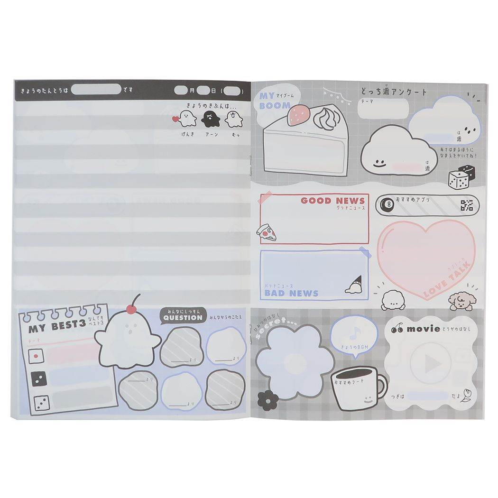

# 「手紙ポスト」アプリ Firebase移行・新機能・交換日記UI/UX 統合仕様書

本ドキュメントは、「手紙ポスト」アプリにおけるローカルモック環境からFirebaseプラットフォームへの移行設計、ワイヤーフレームに基づく情緒的なUI/UX演出、および新規に指定された「フレンドタブ」「グループ機能拡張」「交換日記リレー機能」の全要件を内包した、実装・開発用の統合仕様書です。

---

## 1. アプリケーション概要と基本仕様

「手紙ポスト」は、即時性を重視する現代のチャットアプリとは対照的に、あえて手紙が届くまでに時間を要する（配送時間を要する）「スローライフ」なコミュニケーションを提供するSNSです。
デジタルでありながら、本物の紙やペン、ノートを使ったような温かみ、おしゃれな質感、そして届くまでのワクワク感を演出する情緒的なUI/UXを最大の特徴とします。

### 1.1 主要機能と画面構成・情緒的演出仕様
下部ナビゲーションには以下の5つのタブを配置します。中央の「手紙作成」ボタンは丸く大きく際立たせたモダンなUIとし、タップ時の挙動に特殊な画面遷移を導入します。
* **配置**: `ポスト` / `レーダー` / `手紙作成`（中央・丸く大きく配置） / `フレンド` / `マイページ（設定含む）`

#### ① ポスト（受信箱・送信履歴・配送ステータス表示・交換日記閲覧）
* **情緒的な配送ステータス（「てがみをまつ」演出）**: 
    * 配送中の手紙・交換日記は、無機質な秒単位のカウントダウンではなく、「約h時間後」のように大まかに表現します。
    * 画面上には、可愛い配達員や車のイラストとともに、現在の状況が「向かい中…もう少し！」「しわけ中 まだまだ」といった情緒的な言葉で可視化され、手紙を待つ時間を楽しく演出します。
* **「うけとる」・開封演出**:
    * 手紙や交換日記が届くと「手紙がとどきました！」という通知とともに、画面上に味のある「ポスト」が表示されます。
    * 届いたアイテムは「あける」または「すてる」を選択できます。「あける」を選択すると、実際に封筒から手紙を取り出したり、日記帳の表紙を開いたりするような、おしゃれなアニメーション演出が入ります。
* **受信アイテムの描画と過去の筆跡維持**:
    * 送信者が指定した便箋/日記テーマ、文字サイズ、文字色、フォント（既定、または手書きオリジナル）で美しく描画されます。
    * 送信者が手紙を送信した「その時点の筆跡」を正確に維持するため、データには送信時のフォントの**バージョン情報（リビジョン番号）**を記録し、送信後にフォントが更新されても過去の筆跡が勝手に書き換わらないように保証します。
* **交換日記のリレーハブ機能**:
    * 自分の順番が回ってきた交換日記がポストに届いた際、これまでの全員の記録を「本（見開きノート）のような質感」でパラパラとページをめくって閲覧できる特別なブックビューアUIを提供します。
    * ポスト内の交換日記詳細画面に「**次の人へ書いて送信**」ボタンを配置し、タップするとシームレスに手紙作成と同じフロー（全画面エディタ）へと遷移します。
    * 「秘密の話」や「グットニュース」「バットニュース」「質問相談コーナー」「恋バナ」など、一周回るごとに話題のテーマが与えられる。イメージ： 

#### ② レーダー（置き手紙レーダー）
* フレンドまたは所属グループのメンバーが、特定のGPS位置に設置した「置き手紙（Drop Letter）」を探すための機能です。距離（50m以内）と方向に基づいてレーダー風の画面上にプロットし、実際にその場所まで近づくことで発見・開封できます。

#### ③ 手紙作成 / 交換日記執筆（イマーシブ・全画面エディタ）
* **没入型（イマーシブ）UI**:
    * 下部ナビゲーション中央の丸く大きな「手紙作成」ボタン、またはポストの「次の人へ書いて送信」ボタンを押した瞬間、**下部ナビゲーションバーを完全に隠し、画面全体を執筆専用のエディタ画面へと切り替えます**。これにより、ユーザーが手紙の執筆に完全に没頭できる空間を演出します。
* **おしゃれな執筆・封緘プロセス**:
    1. **「かく（紙選び）」**: 本物の紙の束を「ベラベラ（パラパラ）」とめくって選ぶようなリッチな触感・視覚エフェクトUIで、便箋や日記帳のデザインを決定します。
    2. **「かき中（エディタ）」**: 文字数制限はなく、画面上部のツールバーで「ペン（フォント）」「色」「文字サイズ」を文字・ブロック単位で柔軟に変更しながら長文を執筆できます。写真も1枚添付可能です。
    3. **「かきおわり・しまう演出（封緘）」**: 執筆完了後、ふうとうやシールを選び、便箋が折りたたまれて封筒にシュッと収まる（日記の場合はパタンと閉じられる）アニメーションが走ります。
    4. **「おくる（配送選択）」**: 郵送（距離に応じた所要時間、週3回までの速達制限あり）または置き手紙モードを選択し、最後に手紙をポストに投函する、あるいは相手に直接手渡すような温かみのあるアニメーションを経て送信されます。

#### ④ フレンド（フレンド・グループ管理）
従来のフレンド一覧と、新設されるグループ管理機能を統合したコミュニケーションハブ画面です。
* **フレンド管理**: 「フレンドID検索」「QRコードスキャン」「近距離通信（BLE等を用いた近接端末マッチング）」によるフレンド申請・承認・一覧表示。
* **グループ作成（招待制）**: 
    * 任意のフレンドを複数人選択して、招待制の「グループ」を作成できます。
    * グループ宛てには「メンバー全員への一斉送信手紙」や「グループメンバーなら誰でも開けられる置き手紙」の作成・設置が可能になります。
* **交換日記の同時生成機能**:
    * グループ作成時に「**交換日記も作成する**」チェックボタン（または生成ボタン）を提供します。
    * これを有効にすると、グループ作成と同時に以下の設定画面へ遷移します。
        * **交換順番の設定**: メンバーの一覧をドラッグ＆ドロップで並び替え、日記を回すローテーション順序（例: A → B → C → A...）を決定します。
        * **交換日記のデザイン選択**: 日記の表紙やベースとなるノートのテーマデザインを選択します。
    * 設定完了後、最初の執筆者が「手紙作成」と同様の流れで第1ページ目を執筆し、送信することで交換日記リレーがスタートします。

#### ⑤ マイページ（旧「設定」統合型プロフィール）
* **アカウント・プロフィール編集**: 自身の表示名、アイコン画像、およびフレンドコード（3〜15文字以上、重複不可バリデーションあり）の管理。
* **手書きオリジナルフォント作成機能（一人1セット制限・バージョン管理）**:
    * 上部にお手本の文字を大きく表示し、下部に1:1の手書きキャンバスを配置したUIで、1文字ずつ手書き文字を登録してフォントを差分成長させます。フォント更新時はリビジョン番号をインクリメントします。
* **アプリ設定項目**: カラーモード（ライト/ダーク/システム同期）、多言語切り替え（日本語/英語など）の設定項目をこの画面内に集約します。

---

## 2. Firebase アーキテクチャ設計

### 2.1 Cloud Firestore (データベース設計)


```

/users/{uid} (Document)
├── displayName: String
├── friendId: String
├── photoUrl: String?
├── lastLocation: GeoPoint
├── settings: Map (theme: String, language: String)
├── weeklyExpressCount: Integer
├── lastExpressResetAt: Timestamp
├── fontSettings: Map (hasCustomFont: Boolean, currentFontVersion: Integer)
└── createdAt: Timestamp

/groups/{groupId} (Document)
├── name: String
├── ownerId: String
├── memberIds: Array [uid1, uid2, ...]
├── hasActiveDiary: Boolean (交換日記が有効かどうか)
├── diaryId: String? (関連付けられた交換日記ID)
└── createdAt: Timestamp

/friend_requests/{requestId} (Document)
├── senderId: String
├── recipientId: String
├── status: String (pending, accepted, rejected)
└── createdAt: Timestamp

/friends/{friendshipId} (Document)
├── userIds: Array [uid1, uid2]
└── establishedAt: Timestamp

/letters/{letterId} (Document) (通常手紙・グループ一斉送信・グループ置き手紙共通)
├── senderId: String
├── senderName: String
├── recipientId: String? (個人宛ての場合)
├── recipientGroupId: String? (グループ宛ての一斉送信、またはグループ置き手紙の場合)
├── isGroupDrop: Boolean (グループメンバーの誰でも開ける置き手紙フラグ)
├── openedUserIds: Array [uid1, uid2, ...] (グループ置き手紙等の場合、誰が既に開けたかを管理)
├── mode: String (express, normal, drop)
├── fontType: String (default_gothic, default_mincho, custom_original)
├── fontVersion: Integer?
├── pages: Array [ { content: String, paperTheme: String, textStyles: Array } ]
├── photoUrl: String?
├── envelopeTheme: String
├── sealTheme: String
├── sentAt: Timestamp
├── estimatedDeliveryAt: Timestamp
├── geoLatitude: Double?
├── geoLongitude: Double?
├── status: String (transit, delivered)
└── deliveryDurationSeconds: Integer

/diaries/{diaryId} (Document) (交換日記のステータス・設定管理)
├── groupId: String
├── title: String
├── designTheme: String (日記帳のベースデザインID)
├── rotationOrder: Array [uid1, uid2, uid3, ...] (交換の順番リスト)
├── currentTurnIndex: Integer (現在誰の番かを示すインデックス)
├── currentTurnUserId: String (現在執筆・閲覧の権利を持つユーザーのID)
├── status: String (reading, writing, transit) (ポストに届いて閲覧中/執筆中/配送中)
├── estimatedDeliveryAt: Timestamp? (次の人へ配送中の場合の到着予定時刻)
└── updatedAt: Timestamp

/diaries/{diaryId}/entries/{entryId} (Subcollection) (各ユーザーが書き込んだ日記のページデータ)
├── writerId: String
├── writerName: String
├── fontType: String
├── fontVersion: Integer?
├── pages: Array [ { content: String, diaryPageTheme: String, textStyles: Array } ]
├── photoUrl: String?
├── sentAt: Timestamp
└── sequenceNumber: Integer (何番目の書き込みかを示す連番)

/custom_fonts/{uid} (Document) ── (既定通りフォント履歴管理)
/custom_fonts/{uid}/glyphs/{character} (Subcollection) ── (既定通りグリフデータ管理)

```

---

## 3. 開発・移行タスク一覧（TODOリスト）

### フェーズ 1 ~ 2: 基盤構築・アカウント・フレンド（※既定通りに準ずる）
- [ ] Firebaseプロジェクト初期化、匿名認証の実装
- [ ] 近距離通信(BLE)・QR・ID検索によるフレンド追加機能の実装

### フェーズ 3: ナビゲーション再構築と全画面エディタの実装
- [ ] **ナビゲーション構造の刷新**:
  - [ ] `ポスト` / `レーダー` / `手紙作成` / `フレンド` / `マイページ（設定統合）` の5タブ構成へ変更
- [ ] **手紙作成時の全画面イマーシブUIの実装**:
  - [ ] 中央の「手紙作成」ボタン押下時に、ナビゲーションバーを完全にハイド（非表示）してフルスクリーン画面へ遷移するアニメーションを実装
- [ ] **おしゃれな執筆・封緘エフェクトの実装**:
  - [ ] 便箋をパラパラとめくって選ぶ「紙選び」UIの構築
  - [ ] 執筆終了後に便箋を折りたたんで封筒に入れ、シールを貼る「しまう演出」の実装
  - [ ] 投函・手渡しの情緒的な送信完了アニメーションの実装

### フェーズ 4: フレンドタブの新設とグループ・交換日記生成の実装
- [ ] **フレンドタブ画面の構築**:
  - [ ] 上部にフレンド一覧、下部にグループ一覧を配置するUIの実装
- [ ] **招待制グループ作成機能の実装**:
  - [ ] 複数フレンドを選択してグループを作成するFirestoreトランザクションの実装
- [ ] **交換日記同時生成フローの実装**:
  - [ ] グループ作成画面に「交換日記も作成」トグルを配置
  - [ ] 有効時、メンバーの並び替え（ドラッグ＆ドロップによる順番設定）および日記帳テーマ選択画面へ遷移するUIを実装
  - [ ] 設定完了後、`/diaries` に新規ドキュメントを生成し、そのまま手紙作成と同様の全画面初回執筆フローへ繋げるロジックの実装

### フェーズ 5: グループ拡張機能（一斉送信・グループ置き手紙）の実装
- [ ] **グループ全員宛ての一斉送信ロジックの実装**:
  - [ ] 手紙作成時の宛先選択に「グループ」を指定可能にする
  - [ ] `recipientGroupId` を格納し、グループ全メンバーのポストに届くFirestoreセキュリティルールおよびクエリの構築
- [ ] **グループメンバー用置き手紙の実装**:
  - [ ] 置き手紙（Dropモード）作成時、グループ宛てかつ `isGroupDrop: true` で保存する仕組みの実装
  - [ ] レーダー画面にて、自分が所属するグループの置き手紙を近傍検索（ジオクエリ）で検知するロジックの実装
  - [ ] メンバーの誰かが開封してもドキュメントは削除せず、`openedUserIds` にUIDを追加して既読管理するトランザクションの実装

### フェーズ 6: 交換日記リレーシステムの構築
- [ ] **ポスト画面における交換日記「本・ノート風」ビューアの実装**:
  - [ ] 自分の順番の交換日記が届いた際、`/diaries/{diaryId}/entries` から過去の全エントリを昇順で取得
  - [ ] 見開きノートのような質感で、左右のスワイプでパラパラとページをめくって過去の記録を遡れる情緒的なブック風UIの構築
- [ ] **「次の人へ書いて送信」リレーシステムの実装**:
  - [ ] 交換日記ビューア画面に「次の人へ書いて送信」ボタンを設置
  - [ ] ボタンタップ時、下部ナビゲーションを隠して手紙作成と同等の全画面エディタに遷移
  - [ ] 書き終わり時に、日記がパタンと閉じる専用の封緘エフェクトを実行
  - [ ] 送信時、`currentTurnIndex` をインクリメントして次のメンバーのUIDを `currentTurnUserId` にセットし、ステータスを `transit`（配送中）に更新して新しいエントリ（`entries` サブコレクション）を保存するリレーロジックの実装
- [ ] **ポストでの配送ステータス（「てがみをまつ」）連携**:
  - [ ] 他のメンバーが執筆中、または自分に向かって配送中の交換日記の状況を、可愛いイラストやおまかさな残り時間（「約h時間後」）でポスト画面に表示するUIの実装

### フェーズ 7 ~ 8: フォント最適化・通知・テスト（※既定通りに準ずる）
- [ ] フォントの過去バージョンキャッシュ、オンデバイスビルド/サブセット生成による容量最適化の実装
- [ ] 交換日記や手紙がポストに到着したタイミングでのFCMプッシュ通知実装
- [ ] Firebase Emulator Suiteを用いたグループ・交換日記リレーの結合テスト